#  Part 2 – Fundamentals of Static Timing Analysis (STA)

**Creator & Mentor of the course:** Kunal Ghosh, Co-Founder of VLSI System Design (VSD).  


This part focuses on understanding the **fundamentals of Static Timing Analysis (STA)** — how digital designs are verified for timing closure.  
The course provides in-depth knowledge of **timing checks**, **setup/hold analysis**, and **OCV impact**, but **does not cover constraints and library modeling**.

---

## Table of Contents

1. [Part 2 – Fundamentals of Static Timing Analysis (STA)](#part-2-–-fundamentals-of-static-timing-analysis-sta)
2. [Introduction to STA](#introduction-to-sta)
3. [Timing Path and Key Parameters](#timing-path-and-key-parameters)
   - [Arrival Time](#arrival-time)
   - [Required Time](#required-time)
   - [Slack](#slack)
4. [Types of Setup & Hold Analysis](#types-of-setup--hold-analysis)
5. [Transition (Slew) Analysis](#transition-slew-analysis)
6. [Load Analysis](#load-analysis)
7. [Clock Analysis](#clock-analysis)
8. [Register to Register (Reg2Reg) Analysis](#reg-2-reg-analysis)
   - [Setup Analysis - Single Clock](#set-up-analysis---single-clk)
   - [Timing Graph (DAG)](#timing-graph-dag)
   - [Combinational Logic Analysis](#combinational-logic-analysis)
   - [Actual Arrival Time (AAT)](#actual-arrival-time-aat)
   - [Required Arrival Time (RAT)](#required-arrival-time-rat)
   - [Slack Calculation](#slack-calculation)
9. [STA Analysis Types](#sta-analysis-types)
   - [Graph-Based Analysis (GBA)](#graph-based-analysis-gba)
   - [Path-Based Analysis (PBA)](#path-based-analysis-pba)
10. [Setup Time Analysis](#set-up-time-analysis)
11. [Jitter and Uncertainty](#jitter-and-uncertainty)
    - [Eye Diagram Analysis](#eye-diagram-analysis)
    - [Causes of Jitter](#causes-of-jitter)
    - [Slack Calculation with Uncertainty](#slack-calculation-with-uncertainty)
12. [Setup Time - Graphical to Textual Conversion](#setup-time---graphical-to-textual-conversion)
13. [On-Chip Variation (OCV)](#on-chip-variation-ocv)
    - [Definition and Sources](#definition-and-sources)
    - [Clock Pull-in and Push-out](#clock-pull-in-and-push-out)
    - [Pessimism](#pessimism)
    - [Pessimism Removal](#pessimism-removal)
14. [Key Takeaways](#key-takeaways)
15. [What I Learned](#what-i-learned)
16. [Conclusion](#conclusion)
17. [Credits](#credits)
18. [Completion Certificate from Udemy](#-completion-certificate-from-udemy)

---

## Introduction to STA

**Static Timing Analysis (STA)** is a method to verify the timing of a digital circuit **without applying any input vectors**.  
It checks if all timing paths meet required performance by analyzing **propagation delays**, **setup**, and **hold times**.

STA ensures that every **data signal** arrives and stabilizes at the correct time relative to its **clock signal**.

---

##  Timing Path and Key Parameters

Assume a circuit typically consists of:  
**Launch Flip-Flop → Combinational Logic → Capture Flip-Flop**

**Circuit Daigram:**
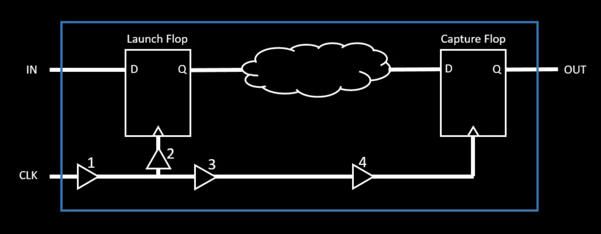

### Arrival Time
Time taken for data to propagate from the **start point** (e.g., Flop clk pin/input port) to the **endpoint** (e.g., Flop D pin/output port).

### Required Time
Time by which the data **must arrive** at the capture register to satisfy setup or hold constraints.

### Slack
The difference between `Required time` and `Arrival time`
```text
Slack = Required Time - Arrival Time
```
- Positive Slack → No violation
- Negative Slack → Timing violation
---

## Types of Setup & Hold Analysis:

```
#  | Timing Type              | Description
---|--------------------------|-------------------------------------------
1  | Register to Register     | Between two sequential elements
2  | Input to Register        | From input port to register
3  | Register to Output       | From register to output port
4  | Input to Output          | Combinational path from input to output
5  | Clock Gating Check       | Ensures enable signal stability
6  | Recovery/Removal         | Checks asynchronous signals like reset
7  | Data to Data             | Combinational data dependency
8  | Latch Time Borrow/Given  | Borrows time from the subsequent stage for its completion
```
### Transition (Slew) Analysis
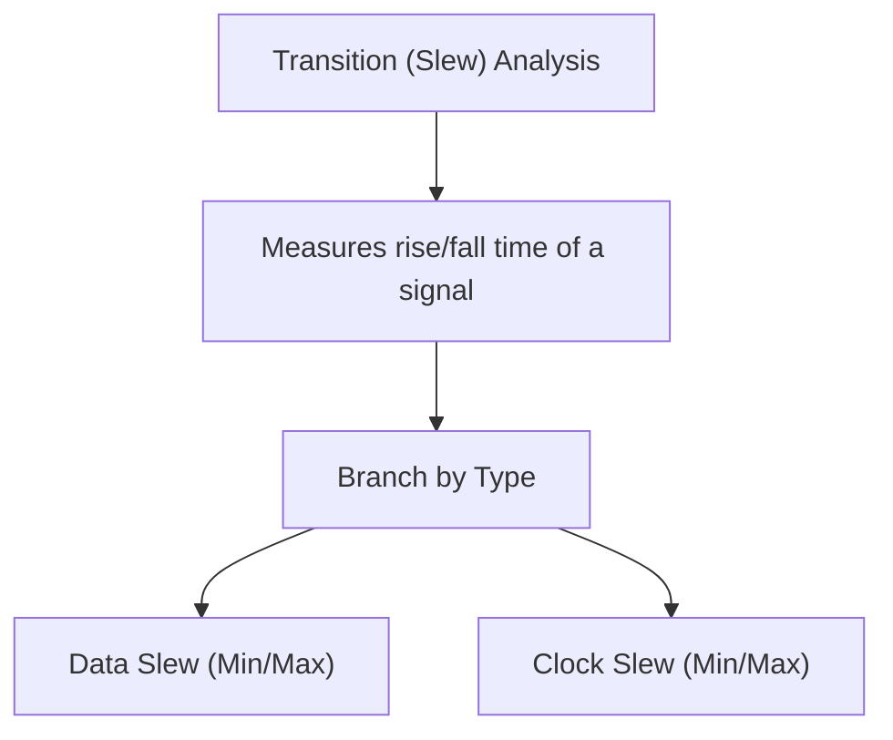

### Load Analysis
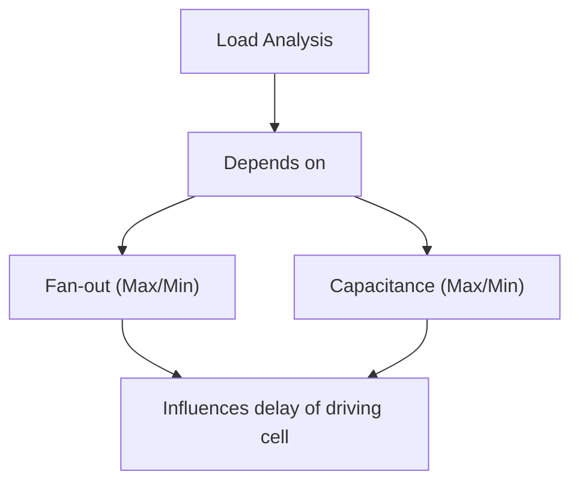
### Clock Analysis
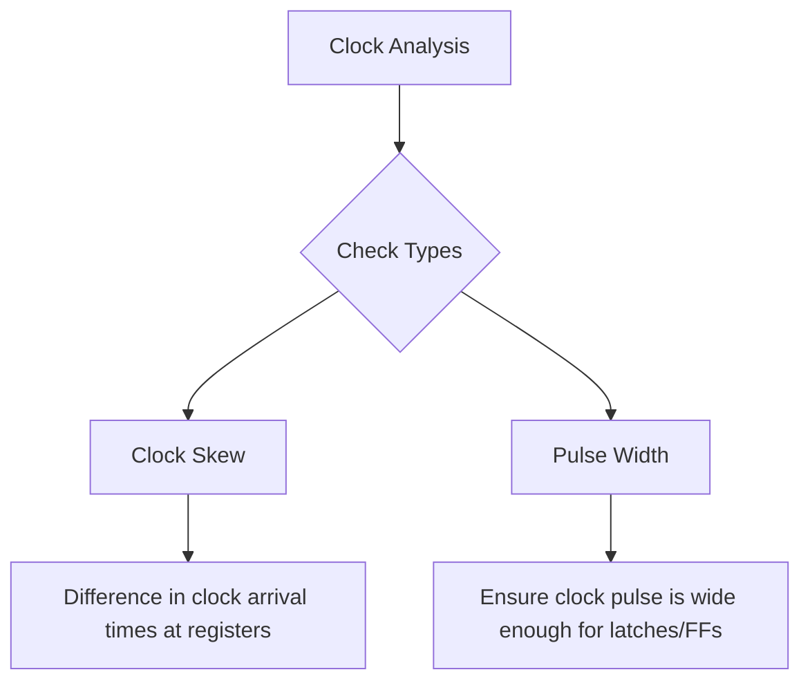
---

## REG 2 REG ANALYSIS

### Set Up Analysis - Single Clk

```bash
spec:
 clk frequency (F) = 1GHz
 clk Period (T)= 1/F = 1ns
```
**Circuit Daigram:**


### Timing Graph (DAG)

- A Directed Acyclic Graph represents all paths and delays.
- We calculate Arrival Time, Required Time, and Slack for each edge.

### Combinational Logic Analysis:
Let us convert the combinational part of the circuit into gates.

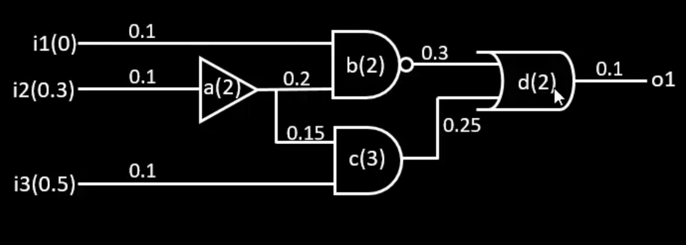

where,
```bash
a(2),b(2),c(3),d(2) - cell Delay (in 'ps')
i1(0),i2(0.3),i3(0.5) - Signal arrival time at inputs (in 'ps')
```
- We will convert the above circuit to a `Directed Cyclic Graph` or `Timing Graph`

**Timing graph of the combinational circuit**

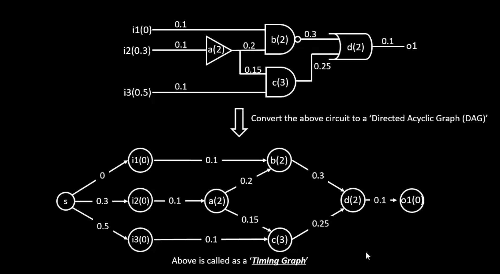

#### Actual Arrival Time (AAT):
- The **Actual Arrival Time** is the **time at any node where we see the latest transition after the first rising clock edge**.  
- It represents when the signal **actually arrives** at a particular point in the circuit during propagation.  

#### Required Arrival Time (RAT)
- The **Required Arrival Time** is the **time at any node where we expect the latest transition within the clock cycle**.  
- It represents when the signal **must arrive** to satisfy timing constraints like setup and hold.

#### Slack Calculation:

```bash
Slack(S) = RAT - AAT
```
- To meet Design expectation RAT > AAT.
---

### STA Analysis Types

#### Graph-Based Analysis (GBA)
- Uses **DAG (Directed Acyclic Graph)** representation.
- Finds **worst-case arrival and required times**.
- **Faster** but less accurate due to **pessimism**.

#### Path-Based Analysis (PBA)
- Considers **exact timing path** from startpoint to endpoint.
- Reduces **pessimism** and provides **best-case and realistic timing**.

---

### Set Up Time Analysis
Lets analyze the time needed for capture flop to catch the data

**Positive Edge triggered Flip Flop using master slave congigutaion screenshot**

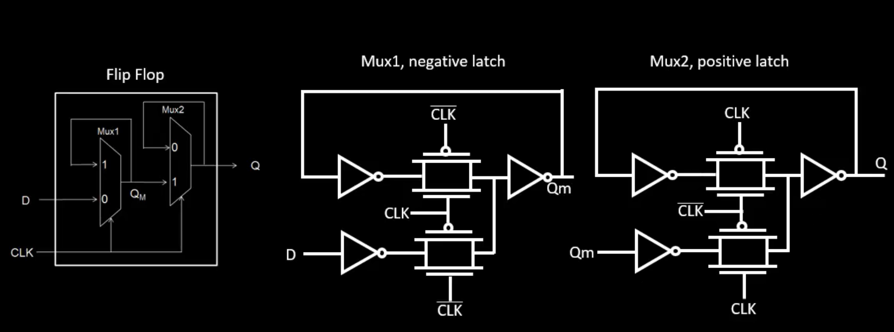

- Where first pass transistor logic is negative latch and and next is postive latch.

**Setup time**
**Setup time** is the **time before the rising edge of the clock** during which the input `D` must remain valid and stable.  
This ensures that the flip-flop can **reliably capture the input** and produce a correct output `Q`.  

**When clk is `negative`** 

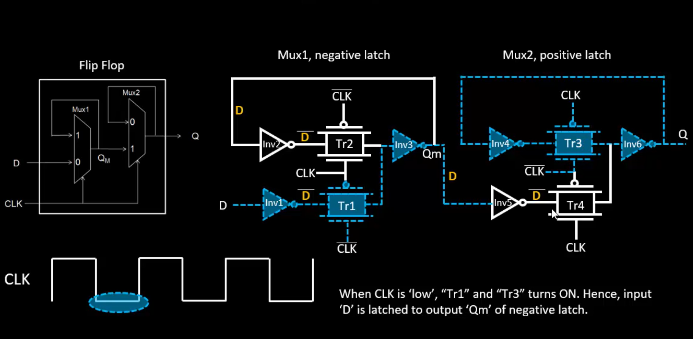

In the given circuit example:  
- Input `D` takes at least **3 inverter delays + 1 transmission gate delay** to become stable before the rising edge of the clock.  
- This time is referred to as the **library setup time**, which is essentially the **time required for `D` to become stable** before it can be safely captured by the flip-flop.

---

### Jitter and Uncertainty

#### Eye Diagram Analysis
- Ideal and real eye diagrams are compared.  
- In real cases, **jitter** causes **eye closure**, reducing the timing margin.

#### Causes of Jitter
- **Power supply variations**  
- **Voltage droop**: A temporary drop in supply voltage due to sudden changes in current, which can slow down signal transitions.  
- **Ground bounce**: A fluctuation in the ground voltage level caused by simultaneous switching of multiple outputs, leading to noise in the signal.

#### Slack Calculation with Uncertainty
- Uncertainty (jitter) is subtracted from the timing margin:  

```bash
Setup Slack = (Required Arrival Time - Actual Arrival Time)
```
**NOTE**
-If Slack is negative ,then it is a serious problem.

- With all this in mind, the setup violation can be avoided if the below conditon is satisfied.

```bash
     (Tcomb + D1) < (T + D2) - S - SU
```
where,
  - Tcomb -> Combinational delay
  - D1 -> Launch Flop clock delay
  - D2 -> Capture Flop clock delay
  - S -> Set Up time
  - Su -> Setup Uncertainity
---

## Setup Time - Graphical to textual conversion

- Till now we have seen and analyzed the circuit graphically, but in industry there will be timing report which is given and have to solve setup and hold violation.

- Lets see this with an example we have seen before.

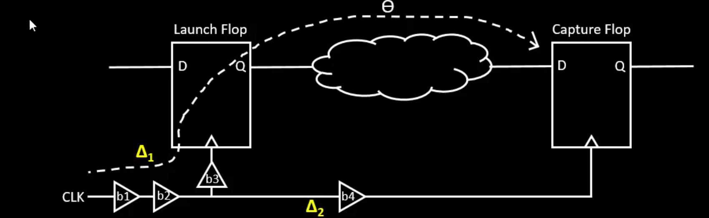

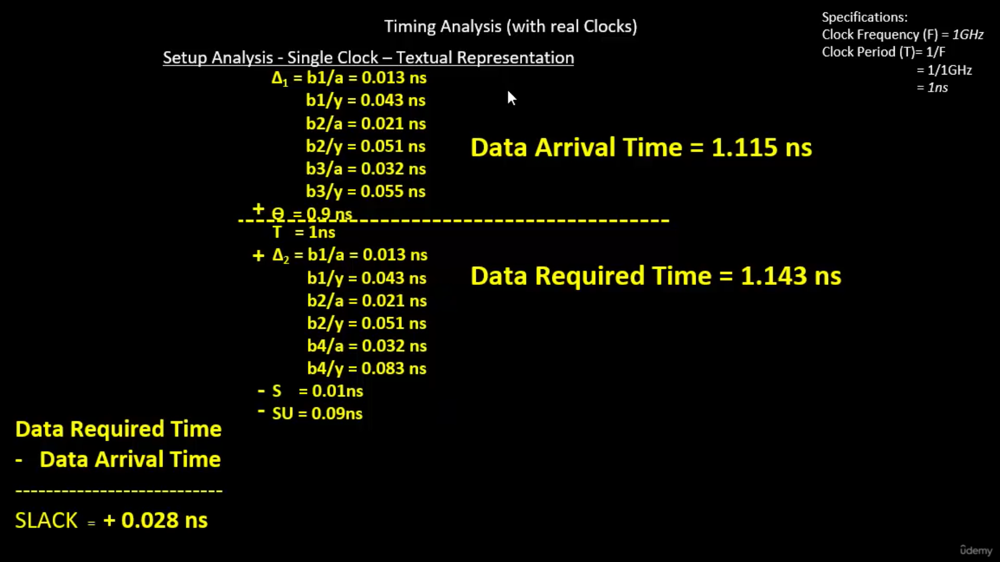

- Without ocv we have analyzed the circuit and there is no `setup violation`.
- Slack is positive , which cnfirms the no violation.
- Similarly we have done this analysis for the hold analysis without OCV.
- We get the condition `(Tcomb + D1) > H + D2 + HU`
- where H -> Hold time, HU -> Hold time uncertainity.
- If the above condition is satisfied, then there will be no `hold time violation`
---

## On-Chip Variation (OCV)
Variation in delay due to process, voltage, or temperature differences across the chip.

**Sources of OCV:**
1) Etching process variation
2) Oxide thickness variation

**Clock Pull-in and Push-out**
```bash
Pull-in: Clock arrives earlier (speedup)
Push-out: Clock arrives later (slowdown)
```
- These affect timing closure and are analyzed using OCV corners.

**Pessimism**
- **Pessimism** refers to the **overestimation of delays or timing margins** in a circuit during Static Timing Analysis.  
- It occurs when the analysis assumes **worst-case conditions** that are more conservative than what may actually happen in real operation.  

**Pessimism Removal**
- After adjusting for clock and data correlation, pessimism is reduced.
- Slack often becomes positive after removal → no violations.

---
## Key Takeaways
- Static Timing Analysis (STA) is critical for verifying **timing correctness** of digital circuits without simulation.  
- Understanding **Actual Arrival Time (AAT)** and **Required Arrival Time (RAT)** is essential for setup and hold analysis.  
- STA uses **Graph-Based Analysis (GBA)** for faster but pessimistic results, and **Path-Based Analysis (PBA)** for accurate, realistic timing.  
- Timing checks include **setup, hold, data-to-data, latch transparency, clock gating, recovery/removal, input-to-register, register-to-output**, etc.  
- Transition (Slew), Load, and Clock analyses help evaluate **signal integrity, delay, and timing margins**.  
- Jitter, voltage droop, and ground bounce affect timing margin and slack; uncertainty must be accounted for.  
- Pessimism in STA can lead to conservative designs; understanding its source helps optimize timing analysis.

---

## What I Learned
- How to calculate **arrival times, required times, and slack** for different paths in a circuit.  
- Detailed understanding of **setup and hold time, library setup time, and latch behavior**.  
- Performing **Graph-Based and Path-Based Analysis**, including advantages and limitations of each.  
- How **clock and data transitions** differ and why clock transitions have tighter requirements.  
- The effect of **uncertainty and on-chip variation (OCV)** on timing analysis.  
- Practical STA workflow in industry including **timing graphs, DAGs, and report interpretation**.
---

## Conclusion
This course provided a **comprehensive overview of STA fundamentals**, including timing checks, slack calculations, transition and load analyses, and the impact of jitter and variations.  
It strengthened my ability to **analyze, interpret, and optimize timing paths** in digital circuits, preparing me for real-world circuit verification and ensuring reliable design performance.

---

## Credits
Thanks to **Kunal Ghosh Sir** for the teaching. The sessions are very clear, neat, and easy to understand.  
I am grateful for this mentorship and am very excited for the upcoming weeks to continue learning and working under his guidance.

---

## Completion Certificate from Udemy

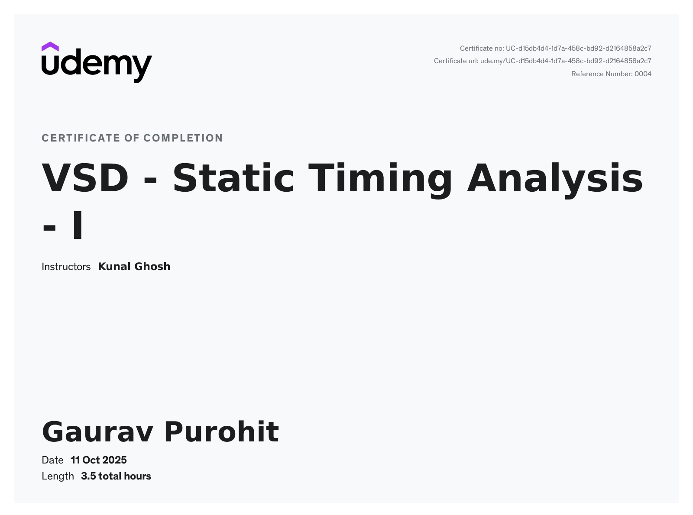

---
